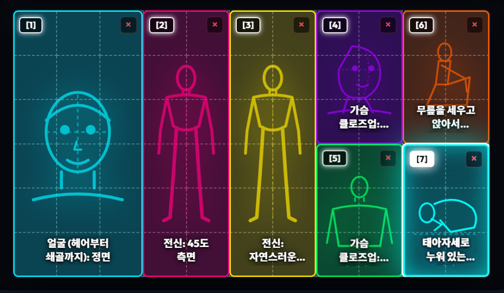
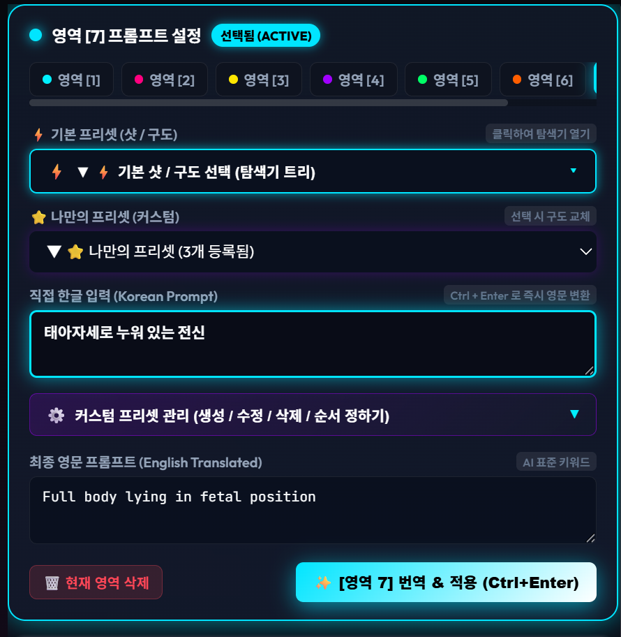
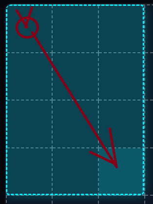
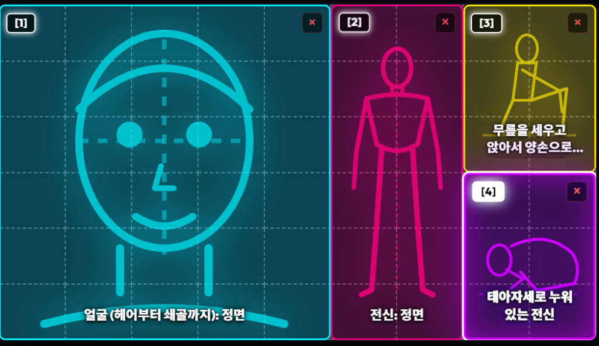
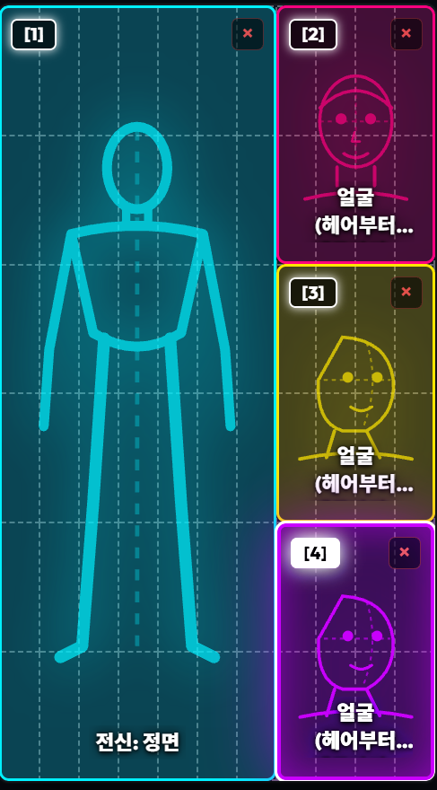

# 🎨 Visual Grid Regional Prompt Studio (Web Pro)
### 📐 AI 비주얼 공간 분할 & 캐릭터 설정화 인터랙티브 프롬프트 생성기

### 🚀 [▶ 온라인 웹 사이트에서 즉시 사용하기 (Live Web App)](https://solokjd-eng.github.io/Visual-Grid-Prompt-Web/)
### 📦 [▶ 무설치 단일 파일 (Visual_Grid_Prompt.html) 다운로드](https://github.com/solokjd-eng/Visual-Grid-Prompt-Web/releases/latest)

**설치 0개, 다운로드 없이 웹 브라우저에서 마우스 드래그로 원하는 공간 구도를 자유롭게 분할하고, 최신 AI(Midjourney, Flux, Krea 2, ComfyUI, ChatGPT, Gemini, SDXL 등)에 최적화된 프롬프트를 자동 생성하는 차세대 인터랙티브 웹 도구입니다.**

[🇰🇷 한국어 설명](#-주요-기능) | [📸 화면 갤러리](#-실제-작업-화면-갤러리) | [🌐 Global Multi-Language](#-글로벌-다국어-지원-global-browser-translate) | [English Overview](#-english-overview)

---

## 📸 실제 작업 화면 갤러리 (Visual Showcase)

  <table>
    <tr>
      <td align="center" width="55%">
        <strong>📐 7분할 캐릭터 설정화 캔버스 (16:9)</strong>  
        
      </td>
      <td align="center" width="45%">
        <strong>⚙️ 실시간 프롬프트 & 탐색기 에디터</strong>  
        
      </td>
    </tr>
  </table>

---

## 🌟 핵심 기능 상세 (Key Features)

### 1. 🖱️ 마우스 드래그 앤 드롭 영역 분할 (Visual Grid Partitioning)
* 바둑판 격자 위에서 마우스로 원하는 시작점에서 끝점까지 대각선으로 드래그하면 직사각형 구역이 1초 만에 생성됩니다.
* 각 영역마다 번호와 고유 네온 컬러가 부여되어 복잡한 다분할 구도도 한눈에 직관적으로 파악할 수 있습니다.

  
  
<em>▲ 마우스 드래그로 원하는 크기와 위치의 패널을 즉시 생성</em>

---

### 2. 📂 윈도우 탐색기형 샷/구도 트리 셀렉터 (10대 캐릭터 시트 분류)
* 평소에는 대분류 폴더만 깔끔하게 보이다가 클릭 시 윈도우 탐색기처럼 하위 소분류가 부드럽게 펼쳐집니다.
* **캐릭터 시트(설정화) 특화 10대 핵심 분류**:
  1. **👤 얼굴 (헤어부터 쇄골까지)**: 정면, 측면, 45도 측면, 위에서 본(하이앵글), 아래에서 본(로우앵글), 후면(뒷머리)
  2. **👁️ 얼굴 초근접 (Extreme Macro Close-up)**: 정면, 측면, 45도 측면
  3. **👚 상반신 가슴까지 (Bust Shot)**: 정면, 측면, 45도 측면, 위에서 본, 아래에서 본
  4. **👗 상반신 허리까지 (Waist Shot)**: 정면, 측면, 45도 측면, 위에서 본, 아래에서 본
  5. **✨ 가슴 클로즈업 (Chest & Neckline)**: 정면, 측면, 45도 측면, 위에서 본, 아래에서 본
  6. **🧍 전신 (Full Body Turnaround)**: 정면, 측면, 45도 측면, 후면(뒷모습 전신), 자연스러운 워킹 포즈
  7. **🦵 하반신 (엉덩이부터 다리/각선미)**: 정면, 측면, 45도 측면, 후면, 매혹적인 포즈
  8. **🍑 엉덩이부 (Hips & Buttocks)**: 골반 정면, 엉덩이 측면, 엉덩이 후면(뒷태), 아래에서 본
  9. **🖐️ 손 클로즈업 (Hands & Fingers)**: 손등, 손바닥
  10. **🦶 발 클로즈업 (Feet & Toes)**: 발등(맨발), 발바닥, 발 정면, 발 45도 측면, 발 측면
* **실시간 검색 지원**: 상단 검색창에 `쇄골`, `발등`, `워킹`, `누운` 등을 입력하면 즉시 필터링됩니다.

---

### 3. 🧍 정밀 벡터 SVG 실루엣 뷰어 & 다양한 레이아웃 지원 (16:9 / 9:16 / 1:1)
* 전신, 얼굴 초근접, 상반신, 손, 발, 엉덩이, 무릎 안고 앉은 자세, 태아자세 누운 전신 등에 맞춰 **캔버스 내부에 정밀 벡터 SVG 실루엣이 100% 동적 렌더링**됩니다.
* 가로형(16:9), 세로형(9:16), 정방형(1:1) 등 어떤 종횡비에서도 완벽하게 자동 스케일링됩니다.

  <table>
    <tr>
      <td align="center" width="50%">
        <strong>📐 4분할 시트 (얼굴 / 전신 / 착석 / 누운 자세)</strong>  
        
      </td>
      <td align="center" width="50%">
        <strong>📱 9:16 세로형 시트 (전신 + 3단 얼굴 앵글)</strong>  
        
      </td>
    </tr>
  </table>

---

### 4. ⚡ 1:1 구도 교체 (Replace) 시스템
* 프리셋이나 구도를 변경할 때 이전 프롬프트 뒤에 쉼표로 계속 누적되지 않고, **선택한 새 구도로 캔버스 실루엣과 텍스트가 깨끗하게 1:1 즉시 교체**됩니다.

---

### 5. ⭐ 나만의 프리셋 (커스텀) 전용 드롭다운 & 관리 서랍
* **독립 2단 셀렉트**: 기본 프리셋과 섞이지 않도록 바로 아래에 나만의 커스텀 프리셋 전용 셀렉트를 제공합니다.
* **[⚙️ 커스텀 프리셋 관리] 서랍**:
  * 클릭 시 아래로 부드럽게 열리는 아코디언 드로어.
  * **마우스 드래그 앤 드롭(Drag & Drop)**으로 프리셋 순서 자유 변경.
  * `[💾 현재 입력 등록]`, `[➕ 새 프리셋 생성]`, `✏️ 수정`, `× 삭제` 완벽 지원.

---

### 6. ☀️ 라이트 모드 / 🌙 다크 모드 (고시인성 스위처)
* **화이트 스튜디오 라이트 테마**: 눈이 편안한 스튜디오 화이트 배경에 깊이 있는 딥 차콜(#0f172a) 폰트를 적용하여 **텍스트와 실루엣의 시인성을 극대화**.
* **테마 설정 영구 기억**: 브라우저를 껐다 켜도 사용자가 선택한 테마를 `localStorage`에 안전하게 기억합니다.

---

### 7. ⚪ 화풍 전환 시 사용자 설정 (백색 배경 등) 영구 유지
* 극실사, 반실사, 2D 애니, 3D CG 등 화풍 버튼을 자유롭게 바꿔도, **사용자가 설정해 둔 `백색 배경 (White Backdrop)` 토글 상태가 풀리지 않고 완벽하게 고정**됩니다.

---

### 8. 🌐 글로벌 다국어 지원 (Global Browser Translate)
* 크롬 / 엣지 / 사파리 등의 브라우저 자동 번역 기능을 통해 **전 세계 100개국 이상의 언어(영어, 일본어, 중국어, 스페인어 등)로 모든 메뉴와 버튼이 1초 만에 자동 번역**됩니다.
* 최종 생성 프롬프트는 **전 세계 AI 표준인 '영어(English)'로 생성**되므로 글로벌 사용자 모두에게 완벽하게 호환됩니다.

---

## 🚀 시작하기 (Getting Started)

### 1) 온라인 웹 사이트에서 실행 (가장 추천 ⭐)
별도의 설치나 파일 다운로드 없이 즐겨찾기 등록 후 즉시 사용하세요:  
👉 **[https://solokjd-eng.github.io/Visual-Grid-Prompt-Web/](https://solokjd-eng.github.io/Visual-Grid-Prompt-Web/)**

### 2) 오프라인 단일 HTML 파일 다운로드
인터넷이 없는 환경에서도 사용할 수 있는 100% 무설치 단일 파일입니다:  
👉 **[Visual_Grid_Prompt.html 다운로드](https://github.com/solokjd-eng/Visual-Grid-Prompt-Web/releases/latest)**

---

## 🧩 ComfyUI 커스텀 노드 버전
ComfyUI 워크플로우 내부에서 커스텀 노드로 직접 연동하여 사용하고 싶으시다면 **[ComfyUI-Visual-Regional-Prompt](https://github.com/solokjd-eng/ComfyUI-Visual-Regional-Prompt)** 저장소를 이용해 주세요.

---

## 📄 라이선스 (License)
This project is open-sourced under the **MIT License**.
